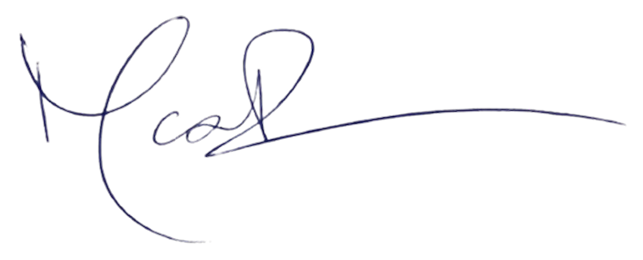
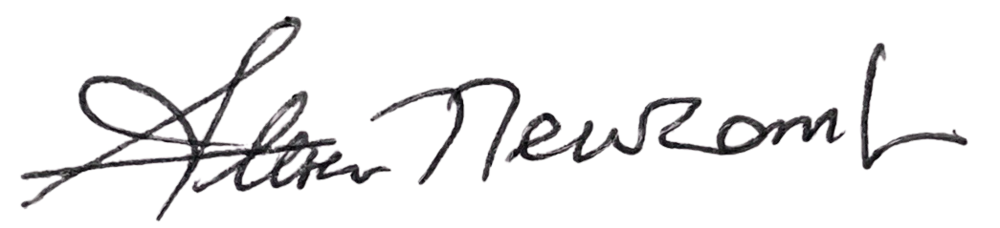

## COLLABORATION AND CULTURAL EXCHANGE AGREEMENT

This Agreement is entered into between **Secret Healing Circle** ("SHC") and **Brar Konsult AB** ("Brar Konsult").

### Background

The parties recognize the growing interest within modern Western therapy, personal development, and trauma recovery in traditional healing practices, ceremonies, and spiritual teachings originating from First Nations peoples of Canada and Native American communities.
SHC preserves and practices traditional teachings, ceremonies, healing circles, and spiritual methods intended to support emotional healing, personal growth, community connection, and recovery from trauma.
Brar Konsult wishes to support the preservation, understanding, and respectful presentation of such traditions through educational events, publications, workshops, cultural exchanges, and related activities.

### Purpose

The purpose of this collaboration is to facilitate educational, cultural, and spiritual exchange through events, writings, consultations, workshops, and other activities organized or coordinated by Brar Konsult.
The parties acknowledge that all activities shall be conducted with respect for the cultural integrity, traditions, and values represented by SHC.

### Contribution

Brar Konsult shall provide a financial contribution of **USD 32,500** to SHC.
The parties acknowledge that this contribution constitutes a gift intended to support SHC, its members, cultural activities, teachings, and preservation of traditional knowledge.
The contribution is made without any obligation of repayment.
All costs related to the organization of events and the publication of written materials shall be covered by Brar Konsult.

### Collaboration

In consideration of the contribution and the mutual objectives of the parties, SHC agrees, when reasonably possible and consistent with its values and traditions, to participate in events, educational activities, consultations, publications, interviews, workshops, and similar initiatives arranged through Brar Konsult.

Nothing in this Agreement shall require SHC or its representatives to disclose ceremonies, teachings, spiritual practices, or cultural knowledge that they consider private, sacred, inappropriate for public disclosure, or inconsistent with their traditions.
         
### Cultural Respect

Brar Konsult acknowledges that SHC's teachings and practices are rooted in spiritual traditions that emphasize harmony, respect, balance, connection with nature, and personal responsibility.

All public activities conducted under this Agreement shall be carried out in a manner that respects these principles and avoids presentations that SHC reasonably considers misleading, exploitative, sensationalized, or inconsistent with its cultural values.

### Independent Parties

The parties remain independent entities.

Nothing in this Agreement shall be interpreted as creating a partnership, joint venture, employment relationship, or ownership interest between the parties.

### Governing Law

This Agreement shall be governed by and interpreted in accordance with Swedish law.

### Signatures

**Signed via email on 08/01/2022**

***Brar Konsult AB***

Max Brar

 

***Secret Healing Circle***

Steven Newcomb
